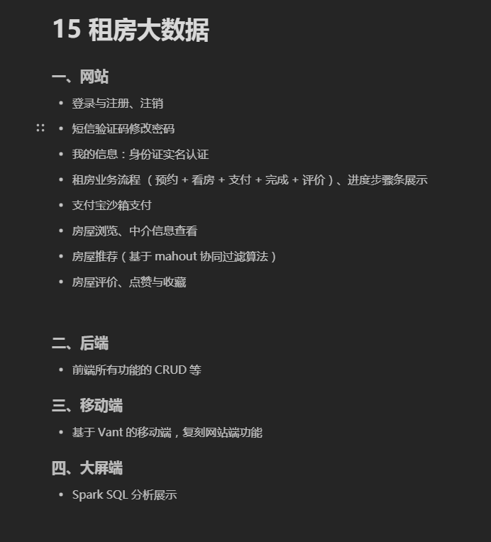
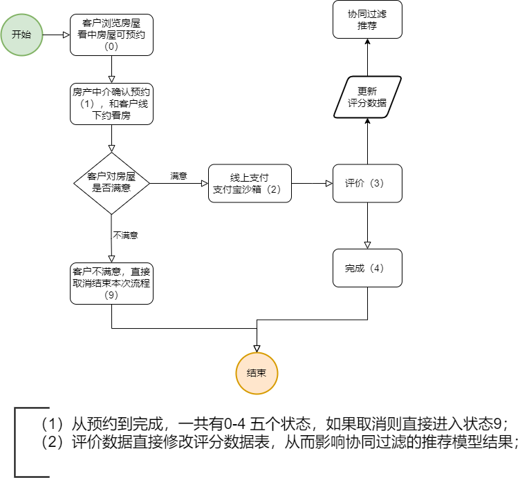
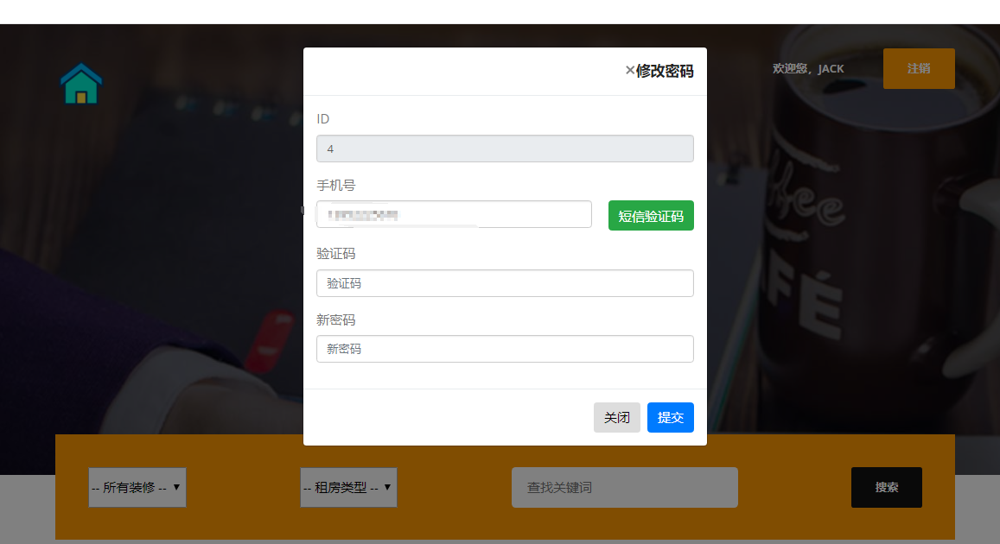
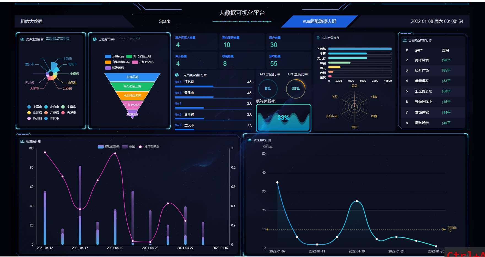
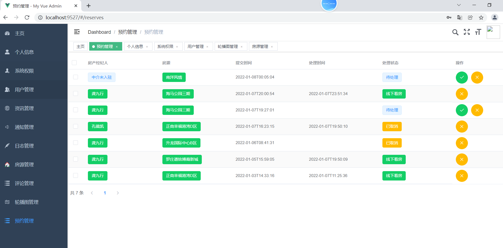
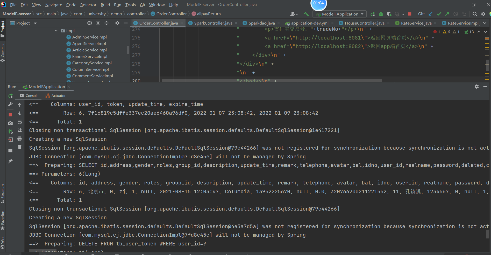

## 计算机毕业设计之全网独家Spark租房爬虫数据分析与推荐系统 租房大数据 租房app 租房数据分析 租房爬虫 房源推荐系统 房源数据分析 房源可视化

## 要求
源码一套有偿(论文 开题报告  文献综述  源码+sql脚本)
加好友前帮忙start一下，并备注github有偿获取源码
我的QQ号是2877135669或者1679232425
加qq好友说明（被部分 网友整得心力交瘁）：
    1.加好友务必按照格式备注
    2.避免浪费各自的时间！
    3.当“客服”不容易，repo 主是体面人，不爆粗，性格好，文明人。

https://www.bilibili.com/video/BV1HL4y1b7TK?spm_id_from=333.999.0.0

# 

## 功能

**一、网站**

· 登录与注册、注销

· 短信验证码修改密码

· 我的信息：身份证实名认证

· 租房业务流程 （预约+看房+支付+完成+评价）、进度步骤条展示

· 支付宝沙箱支付

· 房屋浏览、中介信息查看

· 房屋推荐（基于mahout协同过滤算法）

· 房屋评价、点赞与收藏

**二、后端**

· 统计主页、个人信息（带头像上传）、权限管理、用户管理、资讯管理、通知管理、日志管理、评论管理、轮播图管理、房屋管理、中介管理、订单管理。

· 中介权限可以登录去处理预约

· 最重要的就是房屋管理 + 房屋照片上传 + 房屋与中介信息绑定（因为原来的爬虫数据需要和本系统的用户进行关联）

**三、移动端**

· 基于Vant的移动端

· 首页功能、收藏房屋功能、搜索房屋功能、推荐房屋功能（基于mahout协同过滤算法）

· 个人中心：实名认证、修改信息、短信验证、我的订单、我的预约

**四、大屏端**

这里需要说明的是 spark和mahout是有冲突的，所以我此处的mahout是外部引入的jar，我重新编译了mahout使得可以支持spark的 hadoop2+版本， 而用maven仓库的mahout必然失败。

· Spark SQL 分析展示

· 基础情况：预约流程、房产经纪人、用户统计 ---OK

· 登录情况：APP登录和PC端登录分开统计 ---OK

· 预约看房情况： 统计 ---OK

· 收藏新闻情况 ---OK

· 用户按照省份来源排行统计、柱状图 ---OK

· 用户的来源构成饼图 ---OK

· 用户订单排行榜（金主排行榜） ---OK

· 登录趋势折线图（按照日期） ---OK

· 预定量趋势折线图（按照日期） ---OK

· 用户行为感知分析（登录、下单、收藏、预定、下载、实名认证）雷达图 ---OK

**说明**

· 正常流程是 用户预约→中介在后台确认→用户支付→用户评价→完成

· 租房流程图

# 特点/创新点

创新点：
spark大数据分析
协同过滤推荐算法
AI人工智能身份证自动识别
短信接口
支付宝沙箱支付

​	

# 运行截图

# 运行视频(B站
https://www.bilibili.com/video/BV1HL4y1b7TK?spm_id_from=333.999.0.0

